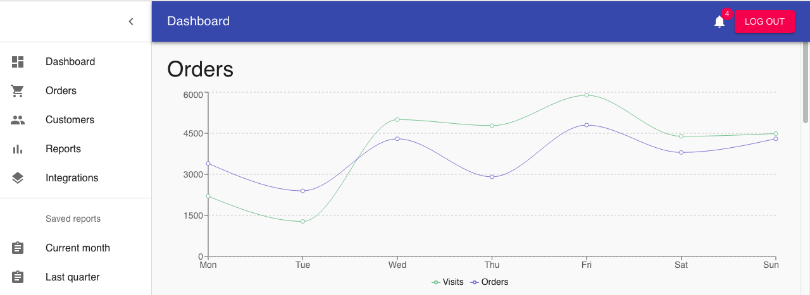
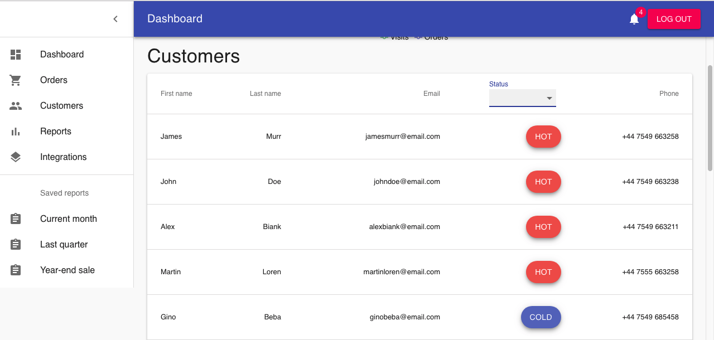

### Requirements

Node + npm (yarn)

### Installing server side

```
cd server
```

Then run:

```
npm install
```
npm start

### Installing client side

```
cd client
```

Then run:

```
yarn install
```
```
npm start
```




